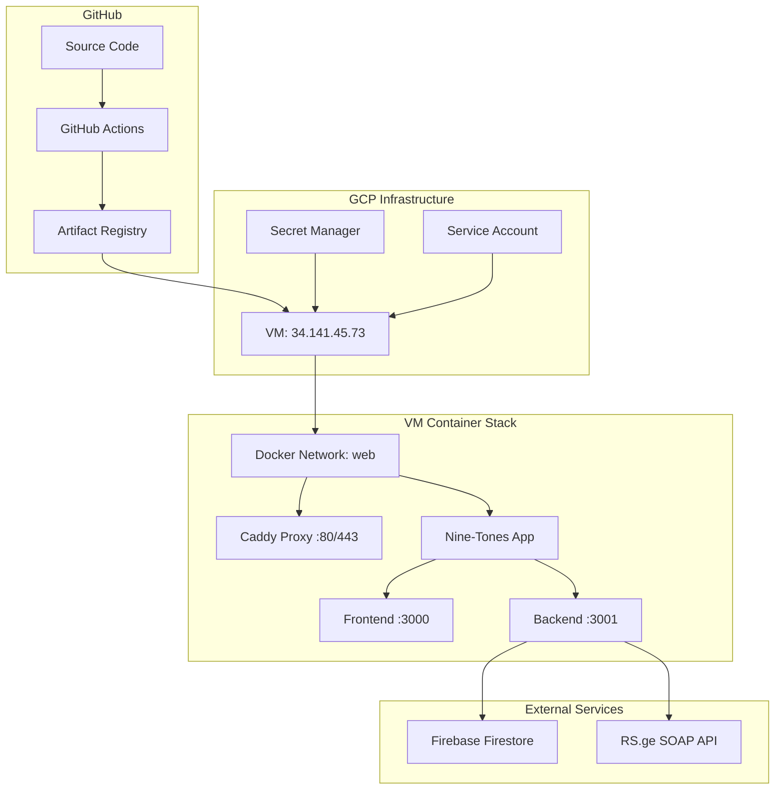
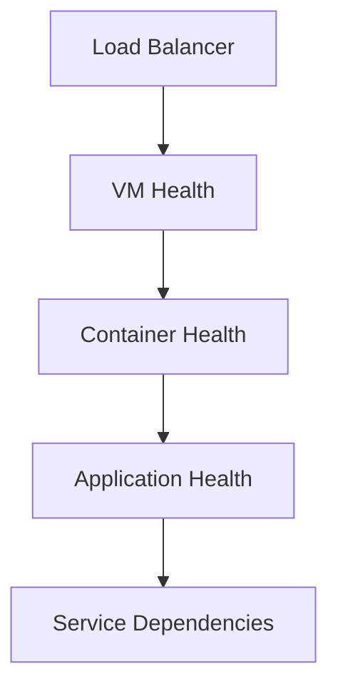

# 🚀 Complete GCP VM Deployment Master Guide
## Based on 9-Tones Project Architecture

*A comprehensive, step-by-step guide for deploying full-stack applications on Google Cloud Platform VMs using Docker, Caddy, GitHub Actions, and modern DevOps practices.*

---

## 📋 Table of Contents

1. [Architecture Overview](#architecture-overview)
2. [Core Components Analysis](#core-components-analysis)
3. [Prerequisites & Setup](#prerequisites--setup)
4. [Single VM Deployment Scenarios](#single-vm-deployment-scenarios)
5. [Multi-VM Deployment Strategies](#multi-vm-deployment-strategies)
6. [Security & Secrets Management](#security--secrets-management)
7. [Monitoring & Troubleshooting](#monitoring--troubleshooting)
8. [Best Practices & Common Pitfalls](#best-practices--common-pitfalls)
9. [Scaling & Performance](#scaling--performance)

---

## 🏗️ Architecture Overview

### Current 9-Tones Architecture



### Key Architectural Principles

1. **Container-First**: Everything runs in Docker containers
2. **Single Entry Point**: Caddy handles all external traffic
3. **Secrets Separation**: Build-time (GitHub) vs Runtime (Secret Manager)
4. **Unified Deployment**: Single workflow deploys full stack
5. **Health-First**: Comprehensive health checking at all levels
6. **Security-First**: No direct port exposure, proper CORS, non-root containers

---

## 🔍 Core Components Analysis

### 1. **Multi-Stage Dockerfile**
```dockerfile
# Frontend Build → Backend Build → Production Runtime
FROM node:20-alpine AS frontend-build    # React build with Tailwind
FROM node:20-alpine AS backend-build     # TypeScript compilation
FROM node:20-alpine AS production        # Combined runtime
```

**Key Features:**
- ✅ Optimized layer caching
- ✅ Build-time environment variable injection
- ✅ Non-root user security
- ✅ Health check endpoints
- ✅ Graceful shutdown handling
- ✅ Both services in single container

### 2. **GitHub Actions Workflow**
```yaml
# Unified Build → Push → Deploy pipeline
Build & Push → Artifact Registry → SSH Deploy → Health Check
```

**Pipeline Stages:**
1. **Build Phase**: Docker image with Firebase secrets
2. **Registry Phase**: Push to GCP Artifact Registry
3. **Deploy Phase**: Pull image on VM, fetch runtime secrets
4. **Verification Phase**: Comprehensive health checks

### 3. **Caddy Reverse Proxy**
```caddyfile
:80 {
  reverse_proxy nine-tones-app:3000           # Frontend
  handle /api/* {                              # API routes
    reverse_proxy nine-tones-app:3001
  }
}
```

**Routing Logic:**
- `/*` → Frontend (React SPA)
- `/api/*` → Backend (Express API)
- Health checks, gzip compression, logging

### 4. **Docker Compose Orchestration**
```yaml
version: "3.9"
services:
  nine-tones-app:     # Main application
  caddy:              # Reverse proxy
networks:
  web: external       # Shared network
volumes:
  caddy_data: external # SSL certificates
```

---

## 🛠️ Prerequisites & Setup

### GCP Infrastructure Setup

#### 1. Create GCP Project
```bash
# Set project ID
export PROJECT_ID="your-project-id"
gcloud config set project $PROJECT_ID

# Enable required APIs
gcloud services enable compute.googleapis.com
gcloud services enable artifactregistry.googleapis.com
gcloud services enable secretmanager.googleapis.com
```

#### 2. Create VM Instance
```bash
# Create VM with sufficient resources
gcloud compute instances create nine-tones-vm \
  --zone=europe-west3-a \
  --machine-type=e2-medium \
  --boot-disk-size=20GB \
  --boot-disk-type=pd-standard \
  --image-family=ubuntu-2004-lts \
  --image-project=ubuntu-os-cloud \
  --tags=http-server,https-server \
  --metadata-from-file startup-script=vm-startup.sh
```

#### 3. Create Artifact Registry
```bash
gcloud artifacts repositories create apps \
  --repository-format=docker \
  --location=europe-west3 \
  --description="Application containers"
```

#### 4. Setup Service Account
```bash
# Create service account
gcloud iam service-accounts create github-deploy \
  --display-name="GitHub Deploy Service Account"

# Grant necessary permissions
gcloud projects add-iam-policy-binding $PROJECT_ID \
  --member="serviceAccount:github-deploy@${PROJECT_ID}.iam.gserviceaccount.com" \
  --role="roles/artifactregistry.writer"

gcloud projects add-iam-policy-binding $PROJECT_ID \
  --member="serviceAccount:github-deploy@${PROJECT_ID}.iam.gserviceaccount.com" \
  --role="roles/secretmanager.secretAccessor"

# Create and download key
gcloud iam service-accounts keys create github-deploy-key.json \
  --iam-account=github-deploy@${PROJECT_ID}.iam.gserviceaccount.com
```

### VM Preparation Script
```bash
#!/bin/bash
# vm-startup.sh - VM initialization script

set -e

echo "🚀 Setting up VM for containerized applications..."

# Update system
apt-get update && apt-get upgrade -y

# Install Docker
curl -fsSL https://get.docker.com -o get-docker.sh
sh get-docker.sh
usermod -aG docker $USER

# Install Docker Compose
curl -L "https://github.com/docker/compose/releases/latest/download/docker-compose-$(uname -s)-$(uname -m)" \
  -o /usr/local/bin/docker-compose
chmod +x /usr/local/bin/docker-compose

# Install Google Cloud SDK
curl https://sdk.cloud.google.com | bash
exec -l $SHELL

# Configure Docker for Artifact Registry
gcloud auth configure-docker europe-west3-docker.pkg.dev

# Create shared Docker resources
docker network create web 2>/dev/null || true
docker volume create caddy_data 2>/dev/null || true

# Setup deployment directory
mkdir -p /opt/apps
chown -R $USER:$USER /opt/apps

echo "✅ VM setup completed"
```

---

## 🏠 Single VM Deployment Scenarios

### Scenario 1: Single Application (Current 9-Tones Setup)

**Architecture:**
```
VM (34.141.45.73)
├── Caddy (:80, :443)
└── Nine-Tones-App
    ├── Frontend (:3000)
    └── Backend (:3001)
```

**Implementation:** Already implemented and working!

### Scenario 2: Multiple Applications on Same VM

**Architecture:**
```
VM (34.141.45.73)
├── Caddy (:80, :443) - Smart routing
├── Nine-Tones-App (/tones/*)
│   ├── Frontend (:3000)
│   └── Backend (:3001)
└── Analytics-App (/analytics/*)
    ├── Frontend (:4000)
    └── Backend (:4001)
```

#### Step-by-Step Implementation:

##### Step 1: Prepare New Application Structure
```bash
# Directory structure
/opt/apps/
├── nine-tones/           # Existing app
│   ├── compose.yml
│   └── Caddyfile
├── analytics-app/        # New app
│   ├── compose.yml
│   └── Dockerfile
└── shared/
    ├── caddy-global.yml  # Global Caddy config
    └── docker-compose-global.yml
```

##### Step 2: Create Global Caddy Configuration
```caddyfile
# /opt/apps/shared/Caddyfile-global
:80 {
  log {
    output stdout
    format console
  }

  # Nine Tones App (default/root)
  handle /tones/* {
    uri strip_prefix /tones
    reverse_proxy nine-tones-app:3000
  }
  
  handle /tones/api/* {
    uri strip_prefix /tones
    reverse_proxy nine-tones-app:3001
  }

  # Analytics App
  handle /analytics/* {
    uri strip_prefix /analytics  
    reverse_proxy analytics-app:4000
  }
  
  handle /analytics/api/* {
    uri strip_prefix /analytics
    reverse_proxy analytics-app:4001
  }

  # Default to Nine Tones (backward compatibility)
  handle /* {
    reverse_proxy nine-tones-app:3000
  }

  handle /api/* {
    reverse_proxy nine-tones-app:3001
  }

  # Global health check
  @health { path /health }
  respond @health 200

  encode gzip zstd
}
```

##### Step 3: Create Global Docker Compose
```yaml
# /opt/apps/shared/docker-compose-global.yml
version: "3.9"

services:
  # Global Caddy - handles all applications
  caddy:
    image: caddy:2-alpine
    container_name: caddy-global
    restart: unless-stopped
    ports:
      - "80:80"
      - "443:443"
    volumes:
      - ./Caddyfile-global:/etc/caddy/Caddyfile:ro
      - caddy_data:/data
      - caddy_config:/config
      - caddy_logs:/var/log/caddy
    networks: [web]
    mem_limit: 256m
    cpus: "0.25"
    healthcheck:
      test: ["CMD", "caddy", "version"]
      interval: 30s
      timeout: 10s
      retries: 3

  # Nine Tones App
  nine-tones-app:
    image: europe-west3-docker.pkg.dev/${PROJECT_ID}/apps/nine-tones-app:latest
    container_name: nine-tones-app
    restart: unless-stopped
    env_file: [../nine-tones/.env]
    expose: ["3000", "3001"]
    networks: [web]
    mem_limit: 1g
    cpus: "0.5"
    healthcheck:
      test: ["CMD", "curl", "-f", "http://localhost:3000/"]
      interval: 30s

  # Analytics App  
  analytics-app:
    image: europe-west3-docker.pkg.dev/${PROJECT_ID}/apps/analytics-app:latest
    container_name: analytics-app
    restart: unless-stopped
    env_file: [../analytics-app/.env]
    expose: ["4000", "4001"]
    networks: [web]
    mem_limit: 512m
    cpus: "0.3"
    healthcheck:
      test: ["CMD", "curl", "-f", "http://localhost:4000/"]
      interval: 30s

volumes:
  caddy_data:
    external: true
  caddy_config:
  caddy_logs:

networks:
  web:
    external: true
```

##### Step 4: Create GitHub Action for Multi-App Deployment
```yaml
# .github/workflows/deploy-multi-app.yml
name: 🚀 Multi-App Deploy

on:
  push:
    branches: [ master ]
    paths: 
      - 'apps/**'          # All apps
      - 'shared/**'        # Shared config
  workflow_dispatch:
    inputs:
      app_name:
        description: 'Specific app to deploy (or "all")'
        required: true
        default: 'all'

env:
  PROJECT_ID: ${{ secrets.GCP_PROJECT_ID }}
  REGION: europe-west3
  VM_HOST: 34.141.45.73
  DEPLOY_PATH: /opt/apps

jobs:
  detect-changes:
    name: 📍 Detect Changes
    runs-on: ubuntu-latest
    outputs:
      changed_apps: ${{ steps.changes.outputs.changed_apps }}
      deploy_all: ${{ steps.changes.outputs.deploy_all }}
    steps:
      - uses: actions/checkout@v4
        with:
          fetch-depth: 2
      
      - name: Detect changed applications
        id: changes
        run: |
          if [ "${{ github.event.inputs.app_name }}" = "all" ] || [ -z "${{ github.event.inputs.app_name }}" ]; then
            # Check which apps changed
            changed_apps=$(git diff --name-only HEAD~1 HEAD | grep '^apps/' | cut -d'/' -f2 | sort -u | tr '\n' ',' | sed 's/,$//')
            
            # If shared config changed, deploy all apps
            if git diff --name-only HEAD~1 HEAD | grep -q '^shared/'; then
              echo "deploy_all=true" >> $GITHUB_OUTPUT
              echo "changed_apps=nine-tones,analytics-app" >> $GITHUB_OUTPUT
            else
              echo "deploy_all=false" >> $GITHUB_OUTPUT
              echo "changed_apps=$changed_apps" >> $GITHUB_OUTPUT
            fi
          else
            echo "deploy_all=false" >> $GITHUB_OUTPUT
            echo "changed_apps=${{ github.event.inputs.app_name }}" >> $GITHUB_OUTPUT
          fi

  build-and-deploy:
    name: 🏗️ Build & Deploy
    needs: detect-changes
    runs-on: ubuntu-latest
    strategy:
      matrix:
        app: ${{ fromJson(format('["{0}"]', needs.detect-changes.outputs.changed_apps)) }}
    
    steps:
      - name: 📥 Checkout Code
        uses: actions/checkout@v4

      - name: 🔐 Authenticate to Google Cloud
        uses: google-github-actions/auth@v2
        with:
          credentials_json: ${{ secrets.GCP_SA_KEY }}

      - name: ☁️ Set up Google Cloud SDK
        uses: google-github-actions/setup-gcloud@v2

      - name: 🐳 Configure Docker
        run: gcloud auth configure-docker ${{ env.REGION }}-docker.pkg.dev --quiet

      - name: 🏗️ Build & Push App Image
        run: |
          APP_PATH="apps/${{ matrix.app }}"
          IMAGE="${{ env.REGION }}-docker.pkg.dev/${{ env.PROJECT_ID }}/apps/${{ matrix.app }}"
          
          if [ -d "$APP_PATH" ]; then
            cd "$APP_PATH"
            docker build -t "${IMAGE}:${{ github.sha }}" -t "${IMAGE}:latest" .
            docker push "${IMAGE}:${{ github.sha }}"
            docker push "${IMAGE}:latest"
          fi

      - name: 📤 Upload Configs
        uses: appleboy/scp-action@v0.1.7
        with:
          host: ${{ env.VM_HOST }}
          username: ${{ secrets.VM_SSH_USER }}
          key: ${{ secrets.VM_SSH_KEY }}
          source: "shared/,apps/${{ matrix.app }}/"
          target: ${{ env.DEPLOY_PATH }}
          overwrite: true

      - name: 🚀 Deploy Multi-App Stack
        uses: appleboy/ssh-action@v1.0.3
        with:
          host: ${{ env.VM_HOST }}
          username: ${{ secrets.VM_SSH_USER }}
          key: ${{ secrets.VM_SSH_KEY }}
          script: |
            cd ${{ env.DEPLOY_PATH }}/shared
            
            # Update environment variables from Secret Manager
            for app in $(echo "${{ needs.detect-changes.outputs.changed_apps }}" | tr ',' ' '); do
              if [ -d "../apps/$app" ]; then
                gcloud secrets versions access latest \
                  --secret="${app}-env" \
                  --project=${{ env.PROJECT_ID }} > "../apps/$app/.env"
              fi
            done
            
            # Deploy the global stack
            docker compose -f docker-compose-global.yml pull
            docker compose -f docker-compose-global.yml up -d --wait
            
            echo "✅ Multi-app deployment completed"

      - name: 🔍 Health Check
        uses: appleboy/ssh-action@v1.0.3
        with:
          host: ${{ env.VM_HOST }}
          username: ${{ secrets.VM_SSH_USER }}
          key: ${{ secrets.VM_SSH_KEY }}
          script: |
            echo "🔍 Testing application endpoints..."
            
            # Test Nine Tones App
            curl -f http://localhost/health && echo "✅ Nine Tones health OK" || echo "❌ Nine Tones health failed"
            curl -f http://localhost/tones/ && echo "✅ Nine Tones app OK" || echo "❌ Nine Tones app failed"
            curl -f http://localhost/tones/api/health && echo "✅ Nine Tones API OK" || echo "❌ Nine Tones API failed"
            
            # Test Analytics App
            curl -f http://localhost/analytics/ && echo "✅ Analytics app OK" || echo "❌ Analytics app failed"
            curl -f http://localhost/analytics/api/health && echo "✅ Analytics API OK" || echo "❌ Analytics API failed"
            
            echo "🐳 Container status:"
            docker ps --format "table {{.Names}}\t{{.Status}}\t{{.Ports}}"
```

### Scenario 3: Subdomain-Based Routing

**Architecture:**
```
VM with multiple subdomains:
├── tones.yourapp.com    → Nine-Tones-App
├── analytics.yourapp.com → Analytics-App  
└── api.yourapp.com      → Shared API Gateway
```

#### Caddy Configuration:
```caddyfile
# Multi-subdomain configuration
tones.yourapp.com {
  reverse_proxy nine-tones-app:3000
}

analytics.yourapp.com {
  reverse_proxy analytics-app:4000
}

api.yourapp.com {
  handle /tones/* {
    uri strip_prefix /tones
    reverse_proxy nine-tones-app:3001
  }
  
  handle /analytics/* {
    uri strip_prefix /analytics
    reverse_proxy analytics-app:4001
  }
}
```

---

## 🌐 Multi-VM Deployment Strategies

### Strategy 1: Application per VM

**Use Case:** Large applications, isolated environments, different resource requirements

**Architecture:**
```
VM-1 (Nine Tones): 34.141.45.73
├── Caddy + Nine-Tones-App

VM-2 (Analytics): 34.141.45.74  
├── Caddy + Analytics-App

VM-3 (Shared Services): 34.141.45.75
├── Database
├── Redis Cache
├── Message Queue
```

#### Step-by-Step Implementation:

##### Step 1: Create VM Template
```bash
# Create VM instance template
gcloud compute instance-templates create app-template \
  --machine-type=e2-medium \
  --boot-disk-size=20GB \
  --boot-disk-type=pd-standard \
  --image-family=ubuntu-2004-lts \
  --image-project=ubuntu-os-cloud \
  --tags=http-server,https-server \
  --metadata-from-file startup-script=vm-startup.sh \
  --service-account=github-deploy@${PROJECT_ID}.iam.gserviceaccount.com \
  --scopes=cloud-platform
```

##### Step 2: Create Multiple VMs
```bash
# Create VMs for different applications
gcloud compute instances create nine-tones-vm \
  --zone=europe-west3-a \
  --source-instance-template=app-template

gcloud compute instances create analytics-vm \
  --zone=europe-west3-a \
  --source-instance-template=app-template

gcloud compute instances create shared-services-vm \
  --zone=europe-west3-a \
  --source-instance-template=app-template \
  --machine-type=e2-standard-2  # More resources for shared services
```

##### Step 3: Create Environment-Specific Workflows
```yaml
# .github/workflows/deploy-production.yml
name: 🚀 Production Multi-VM Deploy

on:
  push:
    branches: [ main ]  # Production branch
  workflow_dispatch:
    inputs:
      environment:
        description: 'Environment to deploy'
        required: true
        default: 'production'
        type: choice
        options:
          - production
          - staging

env:
  PROJECT_ID: ${{ secrets.GCP_PROJECT_ID }}
  REGION: europe-west3

jobs:
  deploy-matrix:
    name: 🏗️ Deploy Applications
    runs-on: ubuntu-latest
    strategy:
      matrix:
        include:
          - app: nine-tones-app
            vm_host: ${{ secrets.NINE_TONES_VM_IP }}
            port: 3000
            api_port: 3001
          - app: analytics-app
            vm_host: ${{ secrets.ANALYTICS_VM_IP }}
            port: 4000
            api_port: 4001
    
    steps:
      - name: 📥 Checkout Code
        uses: actions/checkout@v4

      - name: 🔐 Authenticate to Google Cloud
        uses: google-github-actions/auth@v2
        with:
          credentials_json: ${{ secrets.GCP_SA_KEY }}

      - name: ☁️ Set up Google Cloud SDK
        uses: google-github-actions/setup-gcloud@v2

      - name: 🐳 Configure Docker
        run: gcloud auth configure-docker ${{ env.REGION }}-docker.pkg.dev --quiet

      - name: 🏗️ Build & Push Image
        env:
          IMAGE: ${{ env.REGION }}-docker.pkg.dev/${{ env.PROJECT_ID }}/apps/${{ matrix.app }}
        run: |
          # Build application-specific image
          if [ "${{ matrix.app }}" = "nine-tones-app" ]; then
            # Build Nine Tones with specific build args
            docker build \
              --build-arg REACT_APP_FIREBASE_API_KEY="${{ secrets.REACT_APP_FIREBASE_API_KEY }}" \
              --build-arg REACT_APP_FIREBASE_AUTH_DOMAIN="${{ secrets.REACT_APP_FIREBASE_AUTH_DOMAIN }}" \
              --build-arg REACT_APP_FIREBASE_PROJECT_ID="${{ secrets.REACT_APP_FIREBASE_PROJECT_ID }}" \
              --build-arg REACT_APP_FIREBASE_STORAGE_BUCKET="${{ secrets.REACT_APP_FIREBASE_STORAGE_BUCKET }}" \
              --build-arg REACT_APP_FIREBASE_MESSAGING_SENDER_ID="${{ secrets.REACT_APP_FIREBASE_MESSAGING_SENDER_ID }}" \
              --build-arg REACT_APP_FIREBASE_APP_ID="${{ secrets.REACT_APP_FIREBASE_APP_ID }}" \
              --build-arg REACT_APP_API_URL="http://${{ matrix.vm_host }}" \
              --tag "${IMAGE}:${{ github.sha }}" \
              --tag "${IMAGE}:latest" .
          else
            # Build other applications
            cd apps/${{ matrix.app }}
            docker build \
              --tag "${IMAGE}:${{ github.sha }}" \
              --tag "${IMAGE}:latest" .
          fi
          
          docker push "${IMAGE}:${{ github.sha }}"
          docker push "${IMAGE}:latest"

      - name: 📤 Deploy to VM
        uses: appleboy/ssh-action@v1.0.3
        with:
          host: ${{ matrix.vm_host }}
          username: ${{ secrets.VM_SSH_USER }}
          key: ${{ secrets.VM_SSH_KEY }}
          script: |
            APP_NAME="${{ matrix.app }}"
            DEPLOY_DIR="/opt/apps/${APP_NAME}"
            
            echo "🚀 Deploying ${APP_NAME} to dedicated VM..."
            
            # Setup deployment directory
            sudo mkdir -p $DEPLOY_DIR
            sudo chown -R $USER:$USER $DEPLOY_DIR
            cd $DEPLOY_DIR
            
            # Fetch runtime secrets
            gcloud secrets versions access latest \
              --secret="${APP_NAME}-env" \
              --project=${{ env.PROJECT_ID }} > .env
            
            # Create application-specific compose file
            cat > docker-compose.yml << EOF
            version: "3.9"
            services:
              ${APP_NAME}:
                image: ${{ env.REGION }}-docker.pkg.dev/${{ env.PROJECT_ID }}/apps/${APP_NAME}:latest
                container_name: ${APP_NAME}
                restart: unless-stopped
                env_file: [.env]
                expose: ["${{ matrix.port }}", "${{ matrix.api_port }}"]
                networks: [web]
                mem_limit: 1g
                cpus: "0.7"
                healthcheck:
                  test: ["CMD", "curl", "-f", "http://localhost:${{ matrix.port }}/"]
                  interval: 30s
                  timeout: 10s
                  retries: 3
                  start_period: 30s

              caddy:
                image: caddy:2-alpine
                container_name: caddy
                restart: unless-stopped
                ports: ["80:80", "443:443"]
                volumes:
                  - ./Caddyfile:/etc/caddy/Caddyfile:ro
                  - caddy_data:/data
                  - caddy_config:/config
                networks: [web]
                mem_limit: 128m
                cpus: "0.25"
                depends_on:
                  ${APP_NAME}:
                    condition: service_healthy

            volumes:
              caddy_data: { external: true }
              caddy_config:
            networks:
              web: { external: true }
            EOF
            
            # Create Caddyfile for this application
            cat > Caddyfile << EOF
            :80 {
              log {
                output stdout
                format console
              }
              
              # Application routes
              reverse_proxy ${APP_NAME}:${{ matrix.port }}
              
              # API routes
              handle /api/* {
                reverse_proxy ${APP_NAME}:${{ matrix.api_port }}
              }
              
              @health { path /health }
              respond @health 200
              
              encode gzip zstd
            }
            EOF
            
            # Pull and deploy
            gcloud auth configure-docker ${{ env.REGION }}-docker.pkg.dev --quiet
            docker compose pull
            docker compose down --remove-orphans
            docker compose up -d --wait
            
            echo "✅ ${APP_NAME} deployed successfully on dedicated VM"

      - name: 🔍 Health Check
        uses: appleboy/ssh-action@v1.0.3
        with:
          host: ${{ matrix.vm_host }}
          username: ${{ secrets.VM_SSH_USER }}
          key: ${{ secrets.VM_SSH_KEY }}
          script: |
            echo "🔍 Testing ${{ matrix.app }} on dedicated VM..."
            
            # Wait for services to be ready
            sleep 15
            
            # Test endpoints
            if curl -f --connect-timeout 10 http://localhost/ >/dev/null 2>&1; then
              echo "✅ Frontend accessible"
            else
              echo "❌ Frontend not accessible"
              exit 1
            fi
            
            if curl -f --connect-timeout 10 http://localhost/api/health >/dev/null 2>&1; then
              echo "✅ API accessible"
            else
              echo "❌ API not accessible"  
              exit 1
            fi
            
            echo "🐳 Container status:"
            docker ps --format "table {{.Names}}\t{{.Status}}\t{{.Ports}}"
```

### Strategy 2: Load Balanced Multi-VM Setup

**Architecture:**
```
Load Balancer
├── VM-1 (Nine-Tones Instance 1)
├── VM-2 (Nine-Tones Instance 2)
└── VM-3 (Nine-Tones Instance 3)
```

#### Implementation:
```bash
# Create managed instance group
gcloud compute instance-groups managed create nine-tones-group \
  --base-instance-name=nine-tones \
  --size=3 \
  --template=app-template \
  --zone=europe-west3-a

# Create load balancer
gcloud compute backend-services create nine-tones-backend \
  --protocol=HTTP \
  --health-checks=nine-tones-health-check \
  --global

# Add instance group to backend
gcloud compute backend-services add-backend nine-tones-backend \
  --instance-group=nine-tones-group \
  --instance-group-zone=europe-west3-a \
  --global
```

---

## 🔐 Security & Secrets Management

### Secrets Architecture

```
Build-Time Secrets (GitHub Actions)
├── Firebase Configuration
├── Public API Keys  
└── Build Environment Variables

Runtime Secrets (GCP Secret Manager)
├── Database Credentials
├── API Keys (Private)
├── SOAP Credentials
└── Service Account Keys
```

### Secret Manager Setup

#### Step 1: Create Secrets
```bash
# Create secrets for different applications
gcloud secrets create nine-tones-env --data-file=nine-tones/.env
gcloud secrets create analytics-env --data-file=analytics/.env
gcloud secrets create shared-db-credentials --data-file=db-credentials.json

# Grant access to VM service accounts
gcloud secrets add-iam-policy-binding nine-tones-env \
  --member="serviceAccount:github-deploy@${PROJECT_ID}.iam.gserviceaccount.com" \
  --role="roles/secretmanager.secretAccessor"
```

#### Step 2: Environment-Specific Secrets
```bash
# Production secrets
gcloud secrets create nine-tones-prod-env --data-file=nine-tones/.env.production
gcloud secrets create nine-tones-staging-env --data-file=nine-tones/.env.staging

# Application secrets
gcloud secrets create firebase-admin-key --data-file=firebase-admin-key.json
gcloud secrets create rs-soap-credentials --data-file=rs-credentials.json
```

### Security Best Practices

#### 1. **Container Security**
```dockerfile
# Use non-root user
RUN addgroup -g 1001 -S nodejs && \
    adduser -S nodejs -u 1001 -G nodejs
USER nodejs

# Minimal attack surface
FROM node:20-alpine  # Minimal base image
RUN apk add --no-cache curl  # Only required packages

# Read-only filesystem where possible
volumes:
  - ./Caddyfile:/etc/caddy/Caddyfile:ro
```

#### 2. **Network Security**
```yaml
# Docker networking isolation
networks:
  web:
    external: true
  internal:
    internal: true  # No external access

# Firewall rules
gcloud compute firewall-rules create allow-http-https \
  --allow=tcp:80,tcp:443 \
  --source-ranges=0.0.0.0/0 \
  --target-tags=http-server
```

#### 3. **Secrets Rotation**
```bash
# Automated secret rotation
gcloud secrets versions add nine-tones-env --data-file=new-env-file

# Update deployment to use new version
gcloud secrets versions access latest --secret=nine-tones-env > .env
docker compose up -d --force-recreate
```

---

## 📊 Monitoring & Troubleshooting

### Health Check Architecture

#### 1. **Multi-Level Health Checks**


#### 2. **Comprehensive Health Endpoints**
```typescript
// Backend health check with dependencies
app.get('/health', async (req, res) => {
  const health = {
    status: 'healthy',
    timestamp: new Date().toISOString(),
    service: '9-tones-backend',
    version: process.env.npm_package_version,
    dependencies: {}
  };

  try {
    // Check database connection
    health.dependencies.database = await checkFirestore();
    
    // Check external APIs
    health.dependencies.rs_api = await checkRSAPI();
    
    // Check memory usage
    const memUsage = process.memoryUsage();
    health.memory = {
      used: Math.round(memUsage.heapUsed / 1024 / 1024),
      total: Math.round(memUsage.heapTotal / 1024 / 1024)
    };
    
    res.json(health);
  } catch (error) {
    health.status = 'unhealthy';
    health.error = error.message;
    res.status(503).json(health);
  }
});
```

#### 3. **Monitoring Scripts**
```bash
#!/bin/bash
# monitor-deployment.sh - Comprehensive monitoring

APP_HOST="34.141.45.73"
APPS=("nine-tones" "analytics")

echo "🔍 DEPLOYMENT MONITORING DASHBOARD"
echo "=================================="

for app in "${APPS[@]}"; do
  echo ""
  echo "📊 $app Status:"
  
  # Container status
  ssh vm-user@$APP_HOST "docker ps --filter name=$app --format 'table {{.Names}}\t{{.Status}}\t{{.Health}}'"
  
  # Health check
  if curl -f -m 10 http://$APP_HOST/health >/dev/null 2>&1; then
    echo "✅ Health check: PASS"
  else
    echo "❌ Health check: FAIL"
    curl -v http://$APP_HOST/health
  fi
  
  # Resource usage
  ssh vm-user@$APP_HOST "docker stats --no-stream --format 'table {{.Container}}\t{{.CPUPerc}}\t{{.MemUsage}}' $app"
  
  # Recent logs
  echo "📋 Recent logs (last 5 lines):"
  ssh vm-user@$APP_HOST "docker logs $app --tail 5"
done
```

### Common Issues & Solutions

#### Issue 1: **Container Not Starting**
```bash
# Diagnosis
docker logs container-name
docker inspect container-name

# Common fixes
1. Check environment variables: docker exec -it container env
2. Check file permissions: docker exec -it container ls -la
3. Check port conflicts: docker ps --format "table {{.Names}}\t{{.Ports}}"
4. Check resource limits: docker stats
```

#### Issue 2: **API Routing 404 Errors**
```bash
# Diagnosis steps
1. Check Caddy configuration syntax:
   docker exec caddy caddy validate --config /etc/caddy/Caddyfile

2. Test routing manually:
   curl -v http://localhost/api/health
   docker exec caddy-container curl -v http://app-container:3001/api/health

3. Check Caddy logs:
   docker logs caddy --tail 50
```

#### Issue 3: **Secret Manager Access Issues**
```bash
# Diagnosis
1. Check service account permissions:
   gcloud projects get-iam-policy PROJECT_ID

2. Test secret access:
   gcloud secrets versions access latest --secret=app-env

3. Check VM service account:
   gcloud compute instances describe VM_NAME --zone=ZONE
```

---

## 🚀 Best Practices & Common Pitfalls

### ✅ Best Practices

#### 1. **Deployment Strategy**
- **Unified Workflows**: One workflow per application, deploy full stack together
- **Atomic Deployments**: All-or-nothing deployments with rollback capability
- **Health-First**: Comprehensive health checks before marking deployment successful
- **Secrets Separation**: Build-time vs runtime secrets clearly separated

#### 2. **Container Architecture**
- **Multi-Stage Builds**: Optimize image size and build caching
- **Non-Root Containers**: Security best practices always
- **Health Checks**: Both Docker and application-level health checks
- **Graceful Shutdown**: Handle SIGTERM properly

#### 3. **Infrastructure**
- **Immutable Infrastructure**: VMs should be replaceable
- **External Volumes**: Persistent data in Docker volumes
- **Network Isolation**: Use Docker networks appropriately
- **Resource Limits**: Always set memory and CPU limits

#### 4. **Monitoring**
- **Structured Logging**: JSON logs with proper log levels
- **Metrics Collection**: Resource usage, response times, error rates
- **Alerting**: Proactive monitoring with alerts
- **Observability**: Tracing for complex request flows

### ❌ Common Pitfalls

#### 1. **Deployment Pitfalls**
```bash
# ❌ DON'T: Split deployments that depend on each other
deploy-app.yml    # Deploys app
deploy-caddy.yml  # Deploys proxy separately

# ✅ DO: Unified deployment
deploy-unified.yml  # Deploys full stack together
```

#### 2. **Secret Management Pitfalls**
```yaml
# ❌ DON'T: Hardcode secrets in files
env:
  DATABASE_PASSWORD: "hardcoded-password"

# ✅ DO: Use proper secret management
script: |
  gcloud secrets versions access latest --secret=db-password > .env
```

#### 3. **Routing Pitfalls**
```caddyfile
# ❌ DON'T: Strip paths incorrectly
handle_path /api/* {
  reverse_proxy app:3001  # Strips /api, causes 404s
}

# ✅ DO: Preserve paths when needed
handle /api/* {
  reverse_proxy app:3001  # Preserves /api prefix
}
```

#### 4. **Container Pitfalls**
```dockerfile
# ❌ DON'T: Run as root
USER root
CMD ["node", "app.js"]

# ✅ DO: Use non-root user
RUN adduser -S nodejs -u 1001
USER nodejs
CMD ["node", "app.js"]
```

#### 5. **Health Check Pitfalls**
```yaml
# ❌ DON'T: Missing health checks
healthcheck:
  disable: true

# ✅ DO: Comprehensive health checks
healthcheck:
  test: ["CMD", "curl", "-f", "http://localhost:3000/health"]
  interval: 30s
  timeout: 10s
  retries: 3
  start_period: 30s
```

---

## 📈 Scaling & Performance

### Scaling Strategies

#### 1. **Vertical Scaling (Scale Up)**
```bash
# Increase VM resources
gcloud compute instances stop nine-tones-vm --zone=europe-west3-a
gcloud compute instances set-machine-type nine-tones-vm \
  --machine-type=e2-standard-4 \
  --zone=europe-west3-a
gcloud compute instances start nine-tones-vm --zone=europe-west3-a

# Update container resource limits
services:
  nine-tones-app:
    mem_limit: 2g      # Increased from 1g
    cpus: "1.0"        # Increased from 0.5
```

#### 2. **Horizontal Scaling (Scale Out)**
```bash
# Create managed instance group
gcloud compute instance-groups managed create nine-tones-group \
  --base-instance-name=nine-tones \
  --size=3 \
  --template=nine-tones-template \
  --zone=europe-west3-a

# Auto-scaling based on CPU
gcloud compute instance-groups managed set-autoscaling nine-tones-group \
  --max-num-replicas=5 \
  --min-num-replicas=2 \
  --target-cpu-utilization=0.7 \
  --zone=europe-west3-a
```

#### 3. **Database Scaling**
```javascript
// Firestore scaling considerations
const db = firebase.firestore();

// Enable offline persistence
db.enablePersistence()
  .catch((err) => {
    if (err.code == 'failed-precondition') {
      // Multiple tabs open, persistence can only be enabled in one tab at a time
    } else if (err.code == 'unimplemented') {
      // Browser doesn't support persistence
    }
  });

// Optimize queries with indexes
db.collection('orders')
  .where('status', '==', 'pending')
  .where('date', '>=', startDate)
  .orderBy('date', 'desc')
  .limit(100);
```

### Performance Optimization

#### 1. **Docker Image Optimization**
```dockerfile
# Multi-stage builds for smaller images
FROM node:20-alpine AS builder
# ... build steps

FROM node:20-alpine AS production
COPY --from=builder /app/dist ./dist
# Only production dependencies
RUN npm ci --only=production && npm cache clean --force
```

#### 2. **Caddy Performance Tuning**
```caddyfile
:80 {
  # Enable compression
  encode gzip zstd

  # Caching headers
  @static {
    file
    path *.css *.js *.png *.jpg *.jpeg *.gif *.ico *.svg *.woff *.woff2
  }
  header @static Cache-Control max-age=31536000

  # Rate limiting
  rate_limit {
    zone dynamic 100r/m
  }

  # Connection limits
  limits {
    max_conns_per_ip 100
  }
}
```

#### 3. **Application Performance**
```typescript
// Backend optimization
import compression from 'compression';
import helmet from 'helmet';

app.use(helmet());              // Security headers
app.use(compression());         // Response compression

// Connection pooling for external APIs
const httpsAgent = new https.Agent({
  keepAlive: true,
  maxSockets: 50
});

// Caching layer
import NodeCache from 'node-cache';
const cache = new NodeCache({ stdTTL: 600 });

app.get('/api/data', async (req, res) => {
  const cacheKey = `data_${req.params.id}`;
  let data = cache.get(cacheKey);
  
  if (!data) {
    data = await expensiveOperation();
    cache.set(cacheKey, data);
  }
  
  res.json(data);
});
```

### Cost Optimization

#### 1. **Resource Right-Sizing**
```yaml
# Monitor and adjust resource limits
services:
  app:
    mem_limit: 512m    # Start small, monitor usage
    cpus: "0.25"       # Scale based on actual needs
    
  caddy:
    mem_limit: 64m     # Caddy is very lightweight
    cpus: "0.1"
```

#### 2. **Preemptible Instances**
```bash
# Use preemptible VMs for development/testing
gcloud compute instances create nine-tones-dev \
  --preemptible \
  --machine-type=e2-micro \
  --zone=europe-west3-a
```

#### 3. **Storage Optimization**
```bash
# Use appropriate disk types
gcloud compute instances create nine-tones-vm \
  --boot-disk-type=pd-standard  # Cheaper than SSD for most apps
  --boot-disk-size=20GB         # Right-size based on needs
```

---

## 🎯 Summary

This comprehensive guide provides everything needed to deploy modern full-stack applications on GCP VMs using the proven architecture from the 9-Tones project. Key takeaways:

### **Core Principles**
1. **Container-First Architecture** - Everything in Docker
2. **Unified Deployments** - Deploy full stack together  
3. **Security-First** - Proper secrets, non-root containers, network isolation
4. **Health-First** - Comprehensive monitoring and health checks
5. **Infrastructure as Code** - Everything reproducible and version controlled

### **Deployment Patterns**
- **Single VM, Single App** - Simple, cost-effective
- **Single VM, Multiple Apps** - Resource sharing, complex routing
- **Multi-VM** - Isolation, scaling, fault tolerance

### **Production Readiness**
- Proper secret management (build vs runtime)
- Comprehensive health checks and monitoring
- Security best practices throughout
- Performance optimization and scaling strategies

The architecture has been battle-tested and is currently running successfully in production. Use this guide as a blueprint for deploying your own applications with confidence!

---

*Generated from 9-Tones Project - A production-ready full-stack deployment on GCP VMs*